# Energy-Tracking 
J'ai commencé à m'intéresser à mes consommations de gaz et d'électricité lorsque mon fournisseur m'indiquait: "vous consommez plus que les foyers de taille similaire..." 😒
sans trop savoir comment mon fournisseur avait pu établir ses critères de similarité, j'ai développé cette application pour suivre, traiter et visualiser mes données de consommation de gaz et électricité.
Les données sont récupérées quotidiennement via une API que j'ai conçue dans un autre projet.
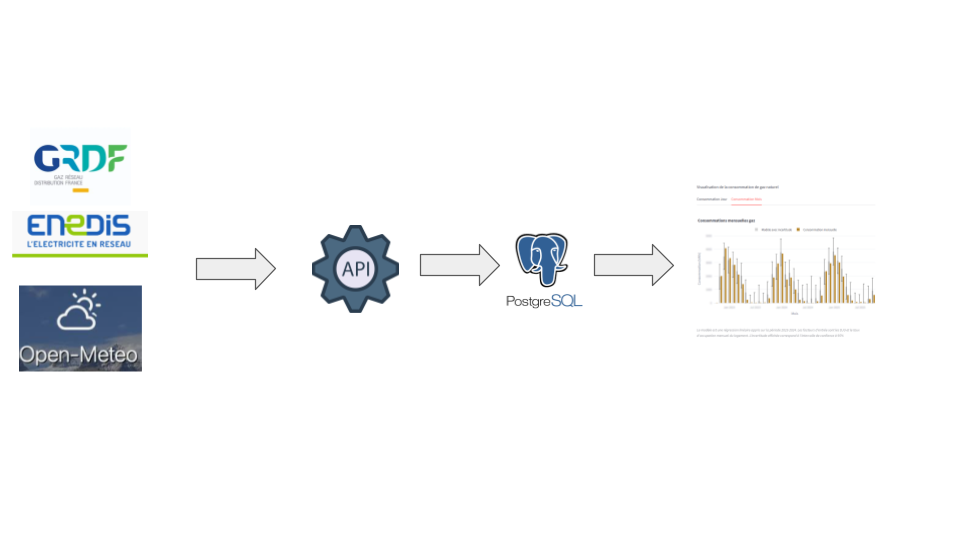

L'application permet:
- De visualiser les consommations à la maille annuelle, mensuelle, journalière et horaire (uniquement pour l'électricité)
- De Comparer les consommations sur des périodes identiques
- De Comparer les consommations par rapport à un modèle basé sur la rigueur climatique et le taux d'occupation du logement
- D'injecter les données journalière de consommation gaz (il n'y a pas d'accès à l'API GRFD pour les particuliers)
- D'afficher des informations sur les données (distribution, données manquantes, périodes couvertes)

## Aperçu de l'application

### Menu *global*
La vue globale affiche les consommations annuelles ansi que les variations de consommation par rapport à l'année précédente, de date à date (Ex: si la date de consultation du rapport est le 11/10/2025, on compare avec les consommations cumulées du 01/01/2024 au 11/10/2024)

  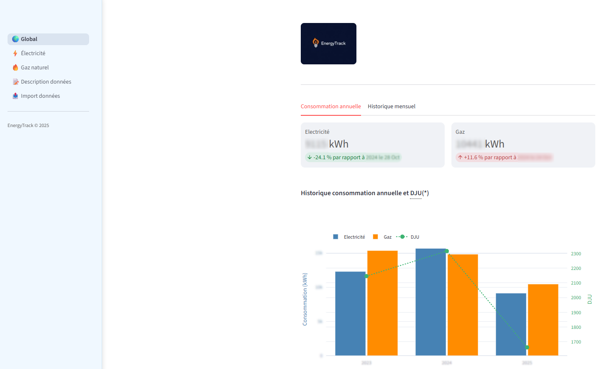

L'onglet *Historique mensuel* affiche les consommations mensuelles ainsi que les DJU

  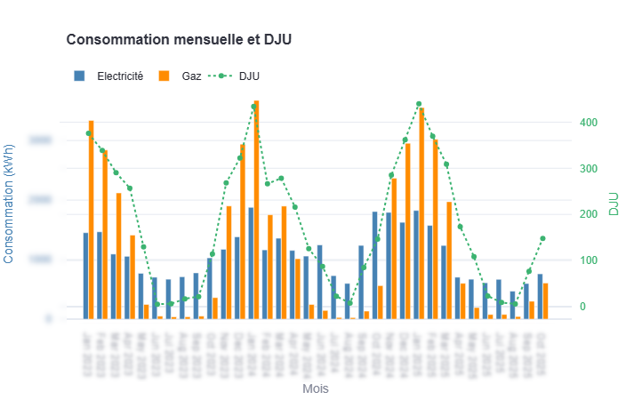

### Menu *Electricité*
Visualisation des consommations horaires, journalières et mensuelles

#### *consommations horaires*
Outre l'historique de consommation horaire, l'application permet de visualiser les profils horaires moyen pour les différents jours de la semaine, avec possibilité de sélectionner une période d'étude. Cela permet d'identifier les pics de consommations

  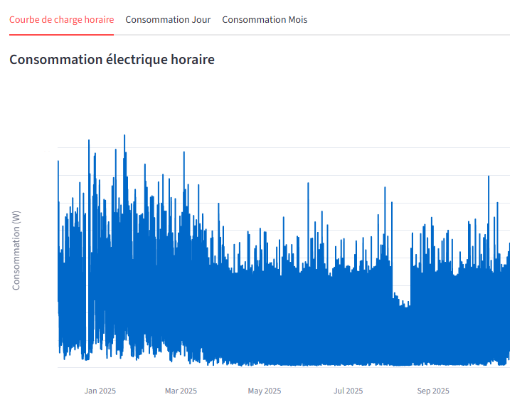
  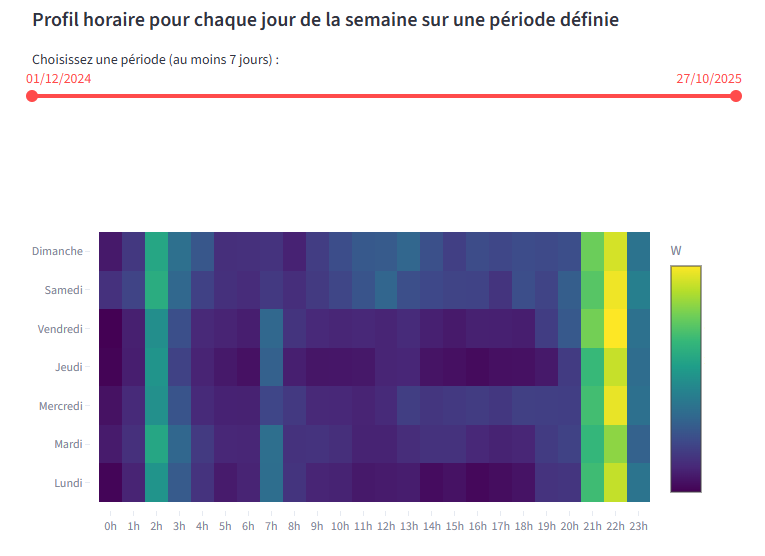

#### *consommations journalières

  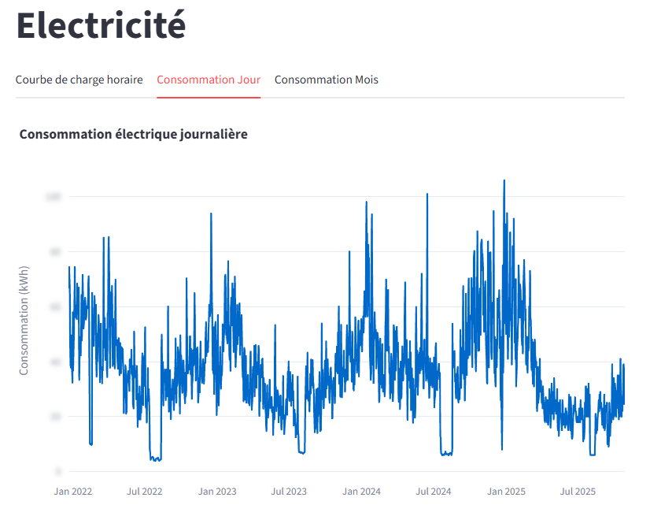

#### *consommations mensuelles*

Le graphe de gauche permet de visualiser les consommations mensuelles et de les comparer avec un modèle. Ce modèle est une régression linéaire apprise sur la période 2023 à 2024 et fonction de 2 facteurs: les DJU et le taux d'occupation du logement. L'intervalle de confiance (à 95%) du modèle est représenté par les barres verticales. Celui-ci reste assez élevé compte tenu de la difficulté à modéliser la consommation d'un logement individuel, par rapport à un groupe de logements pour lesquels les effets stochastiques liés au comportement tendent à s'estomper (d’autant plus qu’il y a de logements).
Le graphe de droite propose les consommations mensuelles groupées par année.

  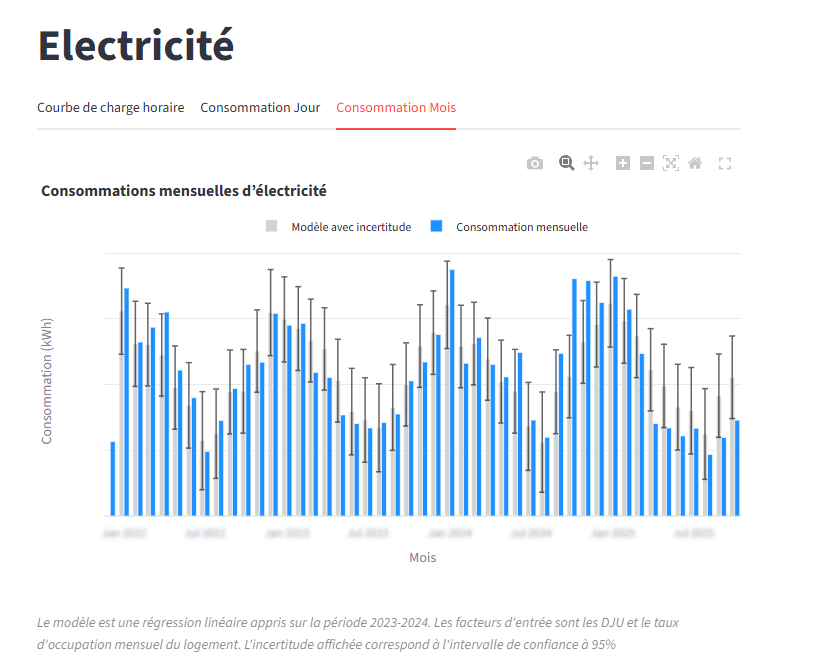
  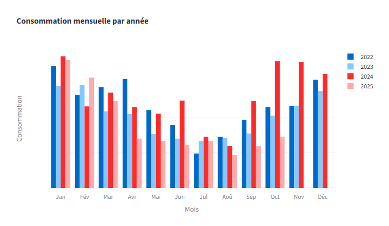

### Menu *Gaz*

Ce menu est similaire au menu *Electricité* hormis les consommations horaires pour lesquelles les données ne sont pas disponibles
Visualisation des consommations horaires, journalières et mensuelles

#### *consommations journalières

  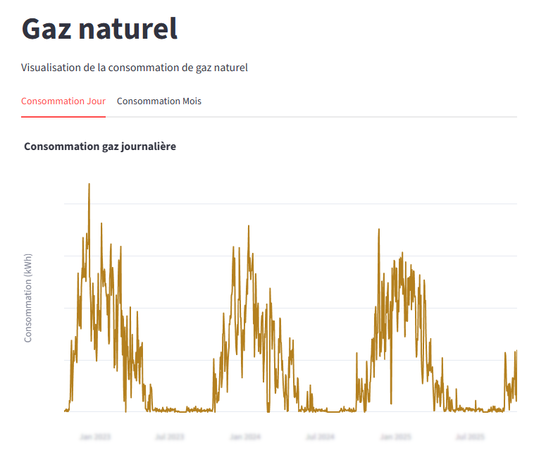

#### *consommations mensuelles*

  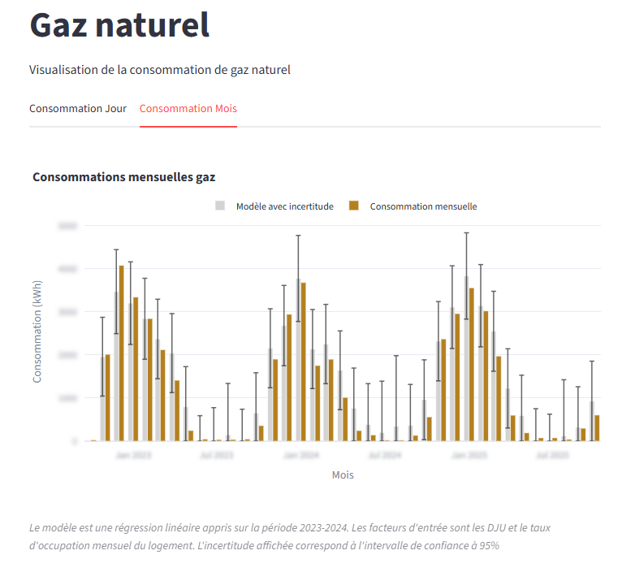
  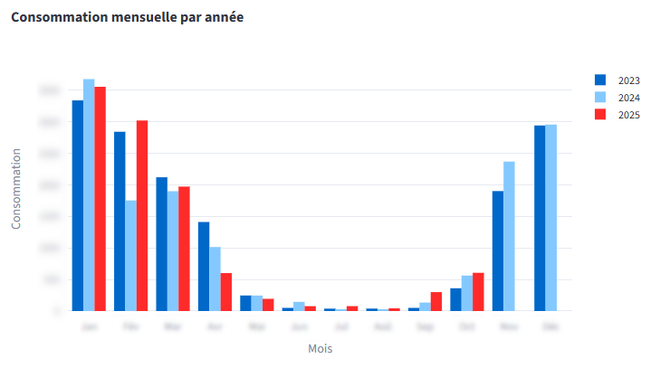

### Menu *Description des données*

Ce menu permet de visualiser, en sélectionnant une variable:
- La distribution et le box plot
- L'écart entre 2 pas de temps successifs (utilise pour vérifier s'il y'a des données manquantes)
Le dernier graphe affiche, sous-forme de diagramme de Gantt, les périodes de temps couvertes par les données

  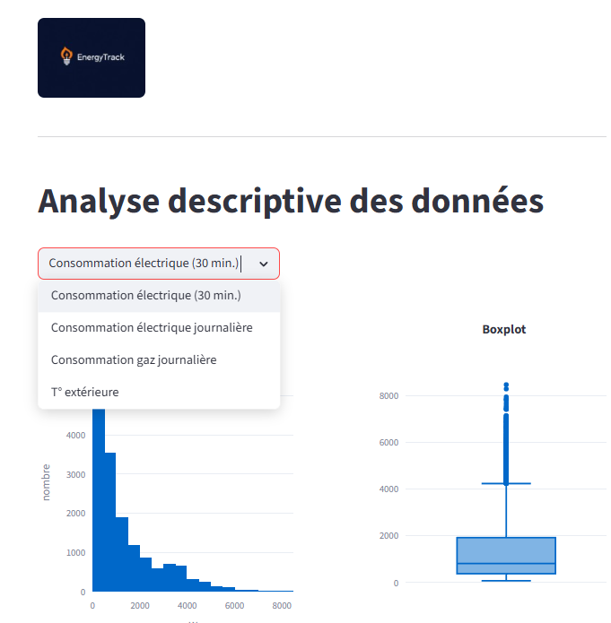

  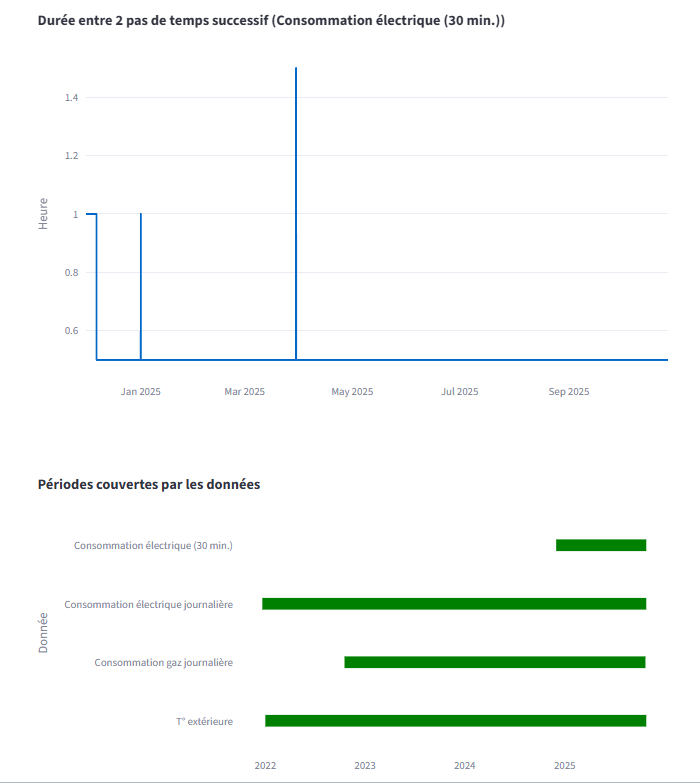

### Menu *Import données*

Ce menu permet d'importer les données de GRDF (et éventuellement ENEDIS) en injectant un fichier Excel que l'on peut télécharger depuis son compte client GRDF.

  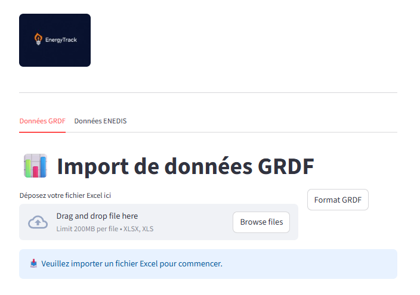

## ⚙️ Technologies utilisées

- [streamlit](https://streamlit.io/) pour l'application web de visualisation
- EC2 AWS pour l'hébergement de l'application sur un serveur virtuel
- Python pour le code
- Docker pour le déploiement de l'application sur EC2
